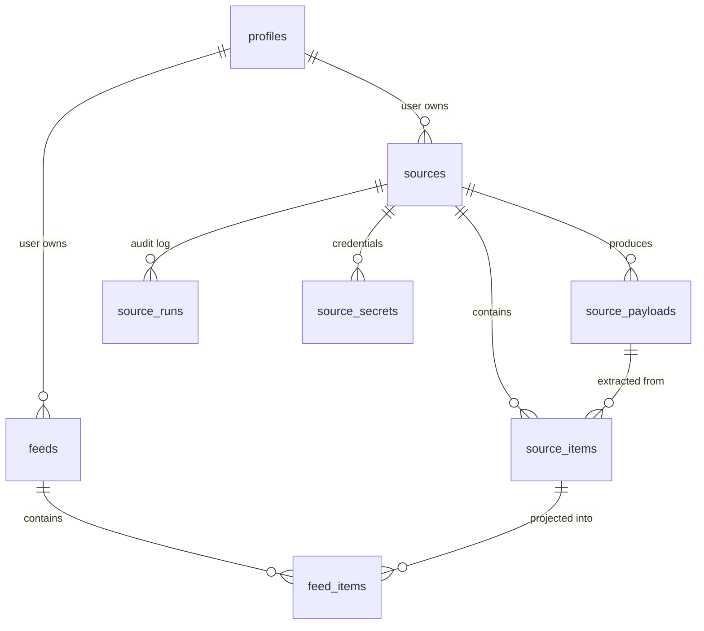

# Phase 1: Foundation -- Schema + CRUD Data Layer

All work happens inside `apps/palace/src/`. No new dependencies needed (Drizzle, Zod, Vitest already installed). Requires local Supabase running (`bun run db:local:start`).

Full spec with code: [docs/IMPLEMENTATION.md](docs/IMPLEMENTATION.md) (lines 559--1045).
Existing patterns to match: [src/db/schema/profiles.ts](apps/palace/src/db/schema/profiles.ts), [src/db/queries/profiles.ts](apps/palace/src/db/queries/profiles.ts).

## Data Model




Seven tables total. All get RLS policies scoped to the authenticated user. `source_runs` and `source_secrets` won't be used until Phase 4 but are created now to avoid migration churn.

## Steps

### 1. Schema files

- Create [src/db/schema/sources.ts](apps/palace/src/db/schema/sources.ts) with 5 tables: `sources`, `sourcePayloads`, `sourceItems`, `sourceRuns`, `sourceSecrets`
- Create [src/db/schema/feeds.ts](apps/palace/src/db/schema/feeds.ts) with 2 tables: `feeds`, `feedItems`
- All tables use `uuid` PKs with `defaultRandom()`, `timestamp(..., { withTimezone: true })`, and `.enableRLS()` with `pgPolicy` -- matching the patterns in `profiles.ts`
- FK relationships: `sources.userId -> profiles.id`, `sourcePayloads.sourceId -> sources.id`, `sourceItems.payloadId -> sourcePayloads.id`, `sourceItems.sourceId -> sources.id` (denormalized), `feedItems.feedId -> feeds.id`, `feedItems.sourceItemId -> sourceItems.id`
- `sourceItems.canonicalId` is a nullable self-referencing uuid (future dedup)
- `sources.config`, `sources.runState`, `sources.schedule`, `feeds.config` are `jsonb`; `sources.pipeline` and `feeds.filter` are `text` (Elo expressions)
- RLS on child tables (payloads, items) uses subquery: `source_id in (select id from sources where user_id = auth.uid())`
- Exact schema code is in [IMPLEMENTATION.md lines 79--177](docs/IMPLEMENTATION.md) (sources) and [lines 182--228](docs/IMPLEMENTATION.md) (feeds)

### 2. Update drizzle.ts

- Edit [src/db/drizzle.ts](apps/palace/src/db/drizzle.ts) to import and spread `* as sources` and `* as feeds` into the schema object

### 3. Generate and apply migration

- `bun run db:generate` then `bun run db:migrate` from `apps/palace`
- Add a second custom migration for indexes (see step 6)
- Verify all 7 tables in Drizzle Studio

### 4. Source query functions

- Create [src/db/queries/sources.ts](apps/palace/src/db/queries/sources.ts)
- Functions: `listSourcesByUser`, `getSourceById`, `createSource`, `updateSource`, `deleteSource`, `createSourcePayload`, `listPayloadsBySource`, `getPayloadById`, `createSourceItems` (batch), `listSourceItemsBySource` (with limit/offset), `listSourceItemsByPayload`, `getSourceItemById`, `countSourceItemsBySource`, `createSourceRun`, `finalizeSourceRun`, `listRunsBySource`, `deleteSourceCascade`
- `deleteSourceCascade` deletes in child-first order: feed_items (via subquery on source_item_id) -> source_items -> source_payloads -> source_runs -> source_secrets -> source
- Type exports: `CreateSourceInput`, `UpdateSourceInput`, `CreatePayloadInput`, `CreateSourceItemInput`, `CreateRunInput`
- Full code: [IMPLEMENTATION.md lines 609--758](docs/IMPLEMENTATION.md)

### 5. Feed query functions

- Create [src/db/queries/feeds.ts](apps/palace/src/db/queries/feeds.ts)
- Functions: `listFeedsByUser`, `getFeedById`, `createFeed`, `updateFeed`, `deleteFeed`, `createFeedItems` (batch), `listFeedItems` (with inner join to `sourceItems`, limit/offset, status filter), `updateFeedItemStatus`, `updateFeedItemUserData`, `countFeedItems`, `deleteFeedCascade`
- `listFeedItems` returns `{ feedItem, sourceItem }` via `innerJoin`
- Type exports: `CreateFeedInput`, `UpdateFeedInput`, `CreateFeedItemInput`
- Full code: [IMPLEMENTATION.md lines 765--870](docs/IMPLEMENTATION.md)

### 6. Indexes (custom migration)

Generate a custom migration (`bun run db:generate --custom`) with this SQL:

```sql
CREATE INDEX idx_source_items_source_id ON source_items (source_id);
CREATE INDEX idx_source_items_url ON source_items (url) WHERE url IS NOT NULL;
CREATE INDEX idx_source_items_created_at ON source_items (created_at DESC);
CREATE INDEX idx_feed_items_feed_status ON feed_items (feed_id, status);
CREATE INDEX idx_feed_items_source_item ON feed_items (source_item_id);
CREATE INDEX idx_source_payloads_source_id ON source_payloads (source_id);
CREATE INDEX idx_source_runs_source_id ON source_runs (source_id, started_at DESC);
```

### 7. Zod validation schemas

- Create [src/lib/validation/sources.ts](apps/palace/src/lib/validation/sources.ts): `sourceTypeEnum`, `createSourceSchema`, `updateSourceSchema`
- Create [src/lib/validation/feeds.ts](apps/palace/src/lib/validation/feeds.ts): `createFeedSchema`, `updateFeedSchema`, `feedItemStatusEnum`
- Full code: [IMPLEMENTATION.md lines 876--935](docs/IMPLEMENTATION.md)

### 8. Tests

- Create [src/db/**tests**/sources.test.ts](apps/palace/src/db/__tests__/sources.test.ts) and [src/db/**tests**/feeds.test.ts](apps/palace/src/db/__tests__/feeds.test.ts)
- Test against local Supabase Postgres (requires `bun run db:local:start`)
- Cases: `createSource` returns defaults, `listSourcesByUser` filters by user, `getSourceById` returns null for missing, `updateSource` bumps `updatedAt`, `deleteSourceCascade` removes full tree, `createSourceItems` batch works, `listSourceItemsBySource` respects limit/offset, `createFeed` returns row, `createFeedItems` links correctly, `listFeedItems` joins + filters by status, `updateFeedItemStatus` changes status

### 9. Verification

- `bun run test` -- all tests pass
- `bun run check-types` -- no type errors
- `bun run lint` -- no lint errors

